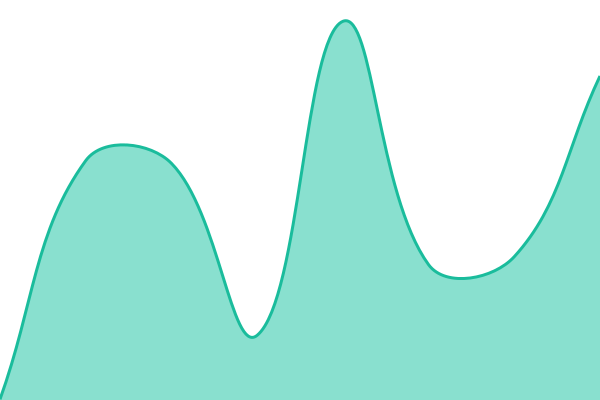
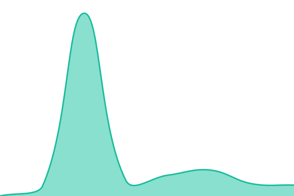
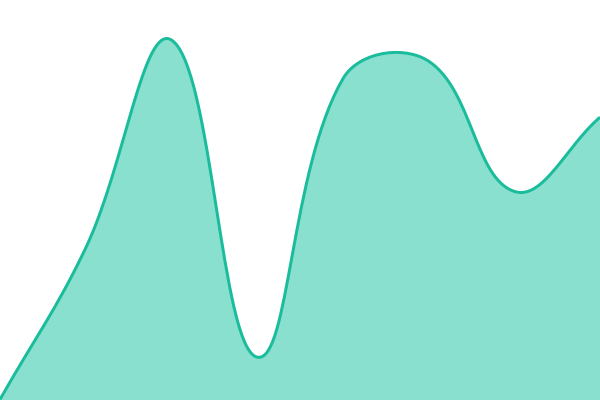

# [Vivideo Status](https://status.vivideo.ai)

This repository contains the open-source uptime monitor and status page for [Vivideo](https://status.vivideo.ai), powered by [Upptime](https://github.com/upptime/upptime).

With [Upptime](https://upptime.js.org), you can get your own unlimited and free uptime monitor and status page, powered entirely by a GitHub repository. We use [Issues](https://github.com/hancerkiranmevlut/vivideo-status/issues) as incident reports, [Actions](https://github.com/hancerkiranmevlut/vivideo-status/actions) as uptime monitors, and [Pages](https://status.vivideo.ai) for the status page.

<!--start: status pages-->
<!-- This summary is generated by Upptime (https://github.com/upptime/upptime) -->
<!-- Do not edit this manually, your changes will be overwritten -->
<!-- prettier-ignore -->
| URL | Status | History | Response Time | Uptime |
| --- | ------ | ------- | ------------- | ------ |
|  [Vivideo Landing](https://vivideo.ai) | 🟩 Up | [vivideo-landing.yml](https://github.com/hancerkiranmevlut/vivideo-status/commits/HEAD/history/vivideo-landing.yml) | 

 225ms
     
 | 

<a href="https://status.vivideo.ai/history/vivideo-landing">100.00%</a>
    

|  [Vivideo Web App](https://app.vivideo.ai) | 🟩 Up | [vivideo-web-app.yml](https://github.com/hancerkiranmevlut/vivideo-status/commits/HEAD/history/vivideo-web-app.yml) | 

 159ms
     
 | 

<a href="https://status.vivideo.ai/history/vivideo-web-app">100.00%</a>
    

|  [Vivideo Developers](https://developers.vivideo.ai) | 🟩 Up | [vivideo-developers.yml](https://github.com/hancerkiranmevlut/vivideo-status/commits/HEAD/history/vivideo-developers.yml) | 

 286ms
     
 | 

<a href="https://status.vivideo.ai/history/vivideo-developers">100.00%</a>
    

|  [Vivideo Partners](https://partners.vivideo.ai) | 🟩 Up | [vivideo-partners.yml](https://github.com/hancerkiranmevlut/vivideo-status/commits/HEAD/history/vivideo-partners.yml) | 

 280ms
     
 | 

<a href="https://status.vivideo.ai/history/vivideo-partners">100.00%</a>
    

<!--end: status pages-->

## ⭐ How it works

- GitHub Actions is used as an uptime monitor
  - Every 5 minutes, a workflow visits each Vivideo endpoint to make sure it's up
  - Response time is recorded and committed to git
  - Graphs of response time are generated every day
- GitHub Issues is used for incident reports
  - An issue is opened automatically if an endpoint is down
  - Issues are closed automatically when the site comes back up
- GitHub Pages is used for the status website at [status.vivideo.ai](https://status.vivideo.ai)

Powered by [Upptime](https://upptime.js.org). _Upptime is not affiliated to or endorsed by GitHub._

## 📄 License

- Powered by: [Upptime](https://github.com/upptime/upptime)
- Code: [MIT](./LICENSE)
- Data in the `./history` directory: [Open Database License](https://opendatacommons.org/licenses/odbl/1-0/)
